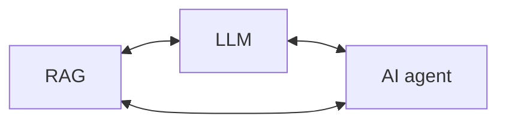

-> 허깅페이스를 통해 LLM을 끌고 오고 LangChain을 통해 AI agent, Rag와 연계

MCP(Model Context Protocol) : LLM(에이전트)이 외부 데이터·도구에 표준 방식으로 연결되도록 하는 오픈 프로토콜입니다. 클라이언트–서버 구조로, 서버가 “tools(실행 기능)·resources(데이터)·prompts(프롬프트 템플릿)” 같은 프리미티브를 노출하고 클라이언트(에이전트 앱)가 이를 발견·호출합니다. 전송은 stdio(로컬)나 Streamable HTTP(원격)를 씁니다. 
OpenAI Agents SDK도 MCP 서버 연동을 지원해 파일시스템 등 다양한 MCP 서버를 붙여 도구/프롬프트를 에이전트에 제공할 수 있습니다.

SFT : **지도 데이터(입력→정답/바람직한 출력)** 로 사전학습된 언어모델을 **지시 따르기·도메인 적응**에 맞게 재학습시키는 단계

RLHF : **사람의 선호 데이터를 이용해 보상모델을 만들고, 그 보상 신호로 언어모델을 강화학습(PPO 등)으로 조정**하는 절차입니다. 간단히 말해, “어떤 답이 더 좋은지”에 대한 인간의 비교 피드백으로 모델의 말투/정책을 정렬(alignment)합니다.

